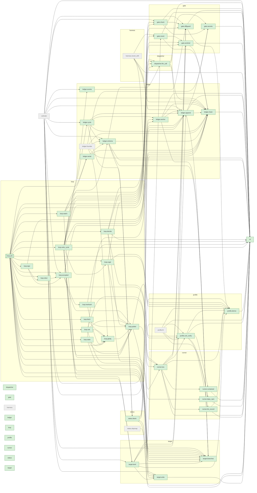

# The brain's dependency map

Generated by `python -m status.depmap brain .` from `referee/`, run there; do not edit by hand.

An arrow A --> B: A holds an import statement naming B. Live roots (double border) are the modules the workflows under `referee/.github/workflows/` start with `python -m`; a live module (green) is reachable from one by imports, which is not proof that it is called; the others (grey) are off the live path: run by tests and vector commands only. Rules and what is not read: `referee/status/depmap.py`.

Modules 52, arrows 168, live roots loop.job, live 46, off the live path 6.

Started by a workflow but not under the root (not drawn): snowball_bootstrap.

Every module off the live path is named, with its reason, in `referee/status/off_live.json` (the last column); a wired module leaves it in the same push. Register problems: none.

```mermaid
flowchart LR
    n0["activate"]
    n1["cli"]
    n2["dispatcher"]
    n4["gate"]
    n10["harness"]
    n12["ledger"]
    n21["loop"]
    n36["profile"]
    n40["runner"]
    n45["status"]
    n48["target"]
  subgraph g_dispatcher["dispatcher"]
    n3["dispatcher.llm_call"]
  end
  subgraph g_gate["gate"]
    n5["gate.check"]
    n6["gate.diffguard"]
    n7["gate.revert"]
    n8["gate.secrets"]
    n9["gate.sentinel"]
  end
  subgraph g_harness["harness"]
    n11["harness.revert_drill"]
  end
  subgraph g_ledger["ledger"]
    n13["ledger.anchor"]
    n14["ledger.append"]
    n15["ledger.chain"]
    n16["ledger.cycle"]
    n17["ledger.events"]
    n18["ledger.founder"]
    n19["ledger.schema"]
    n20["ledger.serial"]
  end
  subgraph g_loop["loop"]
    n22["loop.accepted"]
    n23["loop.cagir"]
    n24["loop.cek"]
    n25["loop.decide"]
    n26["loop.fetch"]
    n27["loop.gitobj"]
    n28[["loop.job"]]
    n29["loop.pulled"]
    n30["loop.rekor"]
    n31["loop.sign"]
    n32["loop.state"]
    n33["loop.treehash"]
    n34["loop.watch"]
    n35["loop.write_cycle"]
  end
  subgraph g_profile["profile"]
    n37["profile.derive"]
    n38["profile.fit"]
    n39["profile.unit_verify"]
  end
  subgraph g_runner["runner"]
    n41["runner.contained"]
    n42["runner.deps_npm"]
    n43["runner.kos"]
    n44["runner.lint_record"]
  end
  subgraph g_status["status"]
    n46["status.block"]
    n47["status.depmap"]
  end
  subgraph g_target["target"]
    n49["target.branches"]
    n50["target.land"]
    n51["target.write"]
  end
  n0 --> n1
  n0 --> n5
  n0 --> n6
  n0 --> n14
  n0 --> n15
  n0 --> n16
  n0 --> n17
  n0 --> n19
  n0 --> n22
  n0 --> n37
  n0 --> n39
  n0 --> n49
  n0 --> n50
  n0 --> n51
  n3 --> n1
  n3 --> n8
  n3 --> n14
  n3 --> n15
  n5 --> n1
  n5 --> n6
  n5 --> n8
  n6 --> n1
  n6 --> n37
  n7 --> n1
  n7 --> n9
  n7 --> n15
  n8 --> n1
  n9 --> n1
  n9 --> n15
  n11 --> n1
  n11 --> n7
  n11 --> n14
  n11 --> n15
  n11 --> n51
  n13 --> n1
  n13 --> n14
  n13 --> n15
  n13 --> n49
  n14 --> n1
  n14 --> n8
  n14 --> n15
  n14 --> n49
  n15 --> n1
  n16 --> n13
  n16 --> n14
  n16 --> n15
  n16 --> n19
  n16 --> n46
  n17 --> n6
  n18 --> n1
  n18 --> n8
  n18 --> n15
  n18 --> n19
  n18 --> n27
  n19 --> n1
  n19 --> n3
  n19 --> n15
  n19 --> n46
  n19 --> n49
  n20 --> n15
  n20 --> n19
  n22 --> n15
  n22 --> n29
  n22 --> n33
  n23 --> n3
  n23 --> n29
  n23 --> n37
  n23 --> n49
  n24 --> n27
  n24 --> n29
  n24 --> n43
  n24 --> n49
  n25 --> n1
  n25 --> n5
  n25 --> n6
  n25 --> n29
  n25 --> n39
  n26 --> n27
  n26 --> n29
  n27 --> n29
  n28 --> n1
  n28 --> n3
  n28 --> n13
  n28 --> n14
  n28 --> n20
  n28 --> n22
  n28 --> n23
  n28 --> n24
  n28 --> n25
  n28 --> n26
  n28 --> n27
  n28 --> n29
  n28 --> n30
  n28 --> n31
  n28 --> n32
  n28 --> n34
  n28 --> n35
  n28 --> n37
  n28 --> n39
  n28 --> n42
  n28 --> n43
  n28 --> n49
  n28 --> n50
  n28 --> n51
  n29 --> n37
  n29 --> n43
  n29 --> n49
  n30 --> n22
  n31 --> n13
  n31 --> n22
  n31 --> n30
  n32 --> n15
  n32 --> n27
  n32 --> n29
  n32 --> n49
  n33 --> n1
  n33 --> n27
  n34 --> n5
  n34 --> n9
  n34 --> n20
  n34 --> n43
  n35 --> n1
  n35 --> n3
  n35 --> n7
  n35 --> n9
  n35 --> n14
  n35 --> n16
  n35 --> n17
  n35 --> n19
  n35 --> n23
  n35 --> n29
  n35 --> n49
  n35 --> n50
  n35 --> n51
  n37 --> n1
  n38 --> n1
  n38 --> n37
  n38 --> n39
  n38 --> n42
  n39 --> n1
  n39 --> n37
  n39 --> n41
  n39 --> n42
  n39 --> n44
  n41 --> n1
  n42 --> n1
  n43 --> n1
  n43 --> n6
  n43 --> n9
  n43 --> n37
  n43 --> n39
  n43 --> n41
  n43 --> n44
  n44 --> n1
  n44 --> n37
  n46 --> n1
  n46 --> n3
  n46 --> n14
  n46 --> n15
  n46 --> n49
  n47 --> n1
  n50 --> n6
  n50 --> n7
  n50 --> n14
  n50 --> n37
  n50 --> n49
  n50 --> n51
  n51 --> n1
  classDef live fill:#d8f0d8,stroke:#2e7d32
  classDef off fill:#eeeeee,stroke:#9e9e9e,color:#616161
  class n1,n2,n3,n4,n5,n6,n7,n8,n9,n12,n13,n14,n15,n16,n17,n19,n20,n21,n22,n23,n24,n25,n26,n27,n28,n29,n30,n31,n32,n33,n34,n35,n36,n37,n39,n40,n41,n42,n43,n44,n45,n46,n48,n49,n50,n51 live
  class n0,n10,n11,n18,n38,n47 off
```

| module | file | live | `__main__` | imports | imported by | off the live path because |
|---|---|---|---|---|---|---|
| activate | activate.py | no | yes | cli, gate.check, gate.diffguard, ledger.append, ledger.chain, ledger.cycle, ledger.events, ledger.schema, loop.accepted, profile.derive, profile.unit_verify, target.branches, target.land, target.write |  | unwired: MF18, step (B): the operator's activation of a target; no workflow under referee/.github/workflows starts it yet |
| cli | cli.py | yes |  |  | activate, dispatcher.llm_call, gate.check, gate.diffguard, gate.revert, gate.secrets, gate.sentinel, harness.revert_drill, ledger.anchor, ledger.append, ledger.chain, ledger.founder, ledger.schema, loop.decide, loop.job, loop.treehash, loop.write_cycle, profile.derive, profile.fit, profile.unit_verify, runner.contained, runner.deps_npm, runner.kos, runner.lint_record, status.block, status.depmap, target.write |  |
| dispatcher | dispatcher/__init__.py | yes |  |  |  |  |
| dispatcher.llm_call | dispatcher/llm_call.py | yes | yes | cli, gate.secrets, ledger.append, ledger.chain | ledger.schema, loop.cagir, loop.job, loop.write_cycle, status.block |  |
| gate | gate/__init__.py | yes |  |  |  |  |
| gate.check | gate/check.py | yes | yes | cli, gate.diffguard, gate.secrets | activate, loop.decide, loop.watch |  |
| gate.diffguard | gate/diffguard.py | yes | yes | cli, profile.derive | activate, gate.check, ledger.events, loop.decide, runner.kos, target.land |  |
| gate.revert | gate/revert.py | yes | yes | cli, gate.sentinel, ledger.chain | harness.revert_drill, loop.write_cycle, target.land |  |
| gate.secrets | gate/secrets.py | yes | yes | cli | dispatcher.llm_call, gate.check, ledger.append, ledger.founder |  |
| gate.sentinel | gate/sentinel.py | yes | yes | cli, ledger.chain | gate.revert, loop.watch, loop.write_cycle, runner.kos |  |
| harness | harness/__init__.py | no |  |  |  | empty package |
| harness.revert_drill | harness/revert_drill.py | no | yes | cli, gate.revert, ledger.append, ledger.chain, target.write |  | unwired: MF14, D8 in job yaz: the cycle's composition inside the jobs is not written (spec-036), so loop.job does not import it |
| ledger | ledger/__init__.py | yes |  |  |  |  |
| ledger.anchor | ledger/anchor.py | yes | yes | cli, ledger.append, ledger.chain, target.branches | ledger.cycle, loop.job, loop.sign |  |
| ledger.append | ledger/append.py | yes | yes | cli, gate.secrets, ledger.chain, target.branches | activate, dispatcher.llm_call, harness.revert_drill, ledger.anchor, ledger.cycle, loop.job, loop.write_cycle, status.block, target.land |  |
| ledger.chain | ledger/chain.py | yes | yes | cli | activate, dispatcher.llm_call, gate.revert, gate.sentinel, harness.revert_drill, ledger.anchor, ledger.append, ledger.cycle, ledger.founder, ledger.schema, ledger.serial, loop.accepted, loop.state, status.block |  |
| ledger.cycle | ledger/cycle.py | yes |  | ledger.anchor, ledger.append, ledger.chain, ledger.schema, status.block | activate, loop.write_cycle |  |
| ledger.events | ledger/events.py | yes |  | gate.diffguard | activate, loop.write_cycle |  |
| ledger.founder | ledger/founder.py | no | yes | cli, gate.secrets, ledger.chain, ledger.schema, loop.gitobj |  | session_tool: the founder ledger's rules and its append command, run by a session and by test 14 (tests/test_founder_ledger.py); the loop never writes founder rows |
| ledger.schema | ledger/schema.py | yes |  | cli, dispatcher.llm_call, ledger.chain, status.block, target.branches | activate, ledger.cycle, ledger.founder, ledger.serial, loop.write_cycle |  |
| ledger.serial | ledger/serial.py | yes |  | ledger.chain, ledger.schema | loop.job, loop.watch |  |
| loop | loop/__init__.py | yes |  |  |  |  |
| loop.accepted | loop/accepted.py | yes |  | ledger.chain, loop.pulled, loop.treehash | activate, loop.job, loop.rekor, loop.sign |  |
| loop.cagir | loop/cagir.py | yes |  | dispatcher.llm_call, loop.pulled, profile.derive, target.branches | loop.job, loop.write_cycle |  |
| loop.cek | loop/cek.py | yes |  | loop.gitobj, loop.pulled, runner.kos, target.branches | loop.job |  |
| loop.decide | loop/decide.py | yes |  | cli, gate.check, gate.diffguard, loop.pulled, profile.unit_verify | loop.job |  |
| loop.fetch | loop/fetch.py | yes |  | loop.gitobj, loop.pulled | loop.job |  |
| loop.gitobj | loop/gitobj.py | yes |  | loop.pulled | ledger.founder, loop.cek, loop.fetch, loop.job, loop.state, loop.treehash |  |
| loop.job | loop/job.py | root | yes | cli, dispatcher.llm_call, ledger.anchor, ledger.append, ledger.serial, loop.accepted, loop.cagir, loop.cek, loop.decide, loop.fetch, loop.gitobj, loop.pulled, loop.rekor, loop.sign, loop.state, loop.watch, loop.write_cycle, profile.derive, profile.unit_verify, runner.deps_npm, runner.kos, target.branches, target.land, target.write |  |  |
| loop.pulled | loop/pulled.py | yes |  | profile.derive, runner.kos, target.branches | loop.accepted, loop.cagir, loop.cek, loop.decide, loop.fetch, loop.gitobj, loop.job, loop.state, loop.write_cycle |  |
| loop.rekor | loop/rekor.py | yes |  | loop.accepted | loop.job, loop.sign |  |
| loop.sign | loop/sign.py | yes |  | ledger.anchor, loop.accepted, loop.rekor | loop.job |  |
| loop.state | loop/state.py | yes |  | ledger.chain, loop.gitobj, loop.pulled, target.branches | loop.job |  |
| loop.treehash | loop/treehash.py | yes | yes | cli, loop.gitobj | loop.accepted |  |
| loop.watch | loop/watch.py | yes |  | gate.check, gate.sentinel, ledger.serial, runner.kos | loop.job |  |
| loop.write_cycle | loop/write_cycle.py | yes |  | cli, dispatcher.llm_call, gate.revert, gate.sentinel, ledger.append, ledger.cycle, ledger.events, ledger.schema, loop.cagir, loop.pulled, target.branches, target.land, target.write | loop.job |  |
| profile | profile/__init__.py | yes |  |  |  |  |
| profile.derive | profile/derive.py | yes | yes | cli | activate, gate.diffguard, loop.cagir, loop.job, loop.pulled, profile.fit, profile.unit_verify, runner.kos, runner.lint_record, target.land |  |
| profile.fit | profile/fit.py | no | yes | cli, profile.derive, profile.unit_verify, runner.deps_npm |  | session_tool: a session composes each unit candidate's recipe from its own npm scripts and judges it with unit_verify.check_recipe; its --units output is targets/<target>/units.json, which loop.cek reads; run by a session and by test 47 (tests/test_profile_fit.py) |
| profile.unit_verify | profile/unit_verify.py | yes | yes | cli, profile.derive, runner.contained, runner.deps_npm, runner.lint_record | activate, loop.decide, loop.job, profile.fit, runner.kos |  |
| runner | runner/__init__.py | yes |  |  |  |  |
| runner.contained | runner/contained.py | yes | yes | cli | profile.unit_verify, runner.kos |  |
| runner.deps_npm | runner/deps_npm.py | yes | yes | cli | loop.job, profile.fit, profile.unit_verify |  |
| runner.kos | runner/kos.py | yes | yes | cli, gate.diffguard, gate.sentinel, profile.derive, profile.unit_verify, runner.contained, runner.lint_record | loop.cek, loop.job, loop.pulled, loop.watch |  |
| runner.lint_record | runner/lint_record.py | yes | yes | cli, profile.derive | profile.unit_verify, runner.kos |  |
| status | status/__init__.py | yes |  |  |  |  |
| status.block | status/block.py | yes | yes | cli, dispatcher.llm_call, ledger.append, ledger.chain, target.branches | ledger.cycle, ledger.schema |  |
| status.depmap | status/depmap.py | no | yes | cli |  | session_tool: the dependency drawings, run in a session and by test 42; the loop never runs it |
| target | target/__init__.py | yes |  |  |  |  |
| target.branches | target/branches.py | yes |  |  | activate, ledger.anchor, ledger.append, ledger.schema, loop.cagir, loop.cek, loop.job, loop.pulled, loop.state, loop.write_cycle, status.block, target.land |  |
| target.land | target/land.py | yes |  | gate.diffguard, gate.revert, ledger.append, profile.derive, target.branches, target.write | activate, loop.job, loop.write_cycle |  |
| target.write | target/write.py | yes | yes | cli | activate, harness.revert_drill, loop.job, loop.write_cycle, target.land |  |
